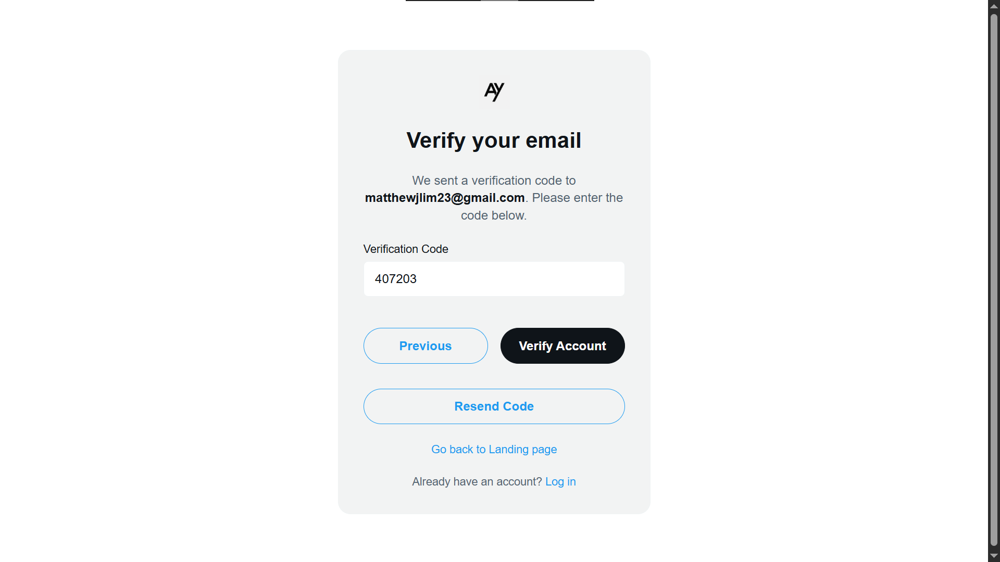

# AY\.com

 

AY\.com is an X\.com (formerly Twitter) clone built as a web app using Go and Svelte. This web app is a social media platform that allows users to share short posts (threads), engage with others, and explore trending topics.

This project was made to complete the Test Progressive Assistant (TPA) in the subject of Web Design and Programming. Building the web app pushed me to learn [a lot of new technologies](#technical-highlights), such as Gin (Go) + gRPC for implementing microservices, RabbitMQ as the message broker, Supabase for media storage, Flask for serving the AI model, Docker for containerization, and Docker Compose for container orchestration. I was guided and tested by Adrian Yu, a lab assistant from BINUS Software Laboratory Center (SLC) and the casemaker of AY\.com. The web app took 6 weeks to develop and achieved a score of 81/100.

**Tech Stack:** Gin (Go), Svelte, PostgreSQL, Redis, gRPC, RabbitMQ, Supabase, WebSockets, Flask (Python), Docker, Docker Compose.

---

## Key Features

### Core Social Experience

-   **Threaded Conversations →** Create threads, post replies, and follow conversations with ease. Content is rendered with rich text, automatically linking `@mentions` to user profiles and `#hashtags` to the explore page.
-   **Rich Media Sharing →** Attach multiple images, GIFs, and videos to threads. Uploads are handled securely and efficiently via Supabase storage.
-   **User Interactions →** Engage with content through likes, reposts, and bookmarks.
-   **Personalized Feeds →** The home page features a "For you" tab with relevant content and a "Following" tab to keep up with threads from accounts you follow.

### Community & Engagement

-   **Communities →** Create and join communities focused on specific topics. Post threads directly to a community, view community-specific feeds (Top, Latest, Media), and manage members.
-   **Real-time Notifications →** Receive instant push notifications for likes, follows, mentions, and other interactions via WebSockets. Email notifications are also sent for important events.
-   **Direct & Group Messaging →** A full-featured, real-time messaging system supports individual DMs and group chats, complete with media sharing and timestamps.

### Discovery & Personalization

 <!-- Suggestion: Add a screenshot -->

-   **Explore Page →** Discover new content and users. The default view showcases trending hashtags.
-   **Fuzzy Search →** An advanced search engine allows users to find threads and people even with minor typos, powered by a custom Damerau-Levenshtein distance algorithm.
-   **Powerful Filtering →** Search results can be filtered by categories, or by user groups like "People you follow" and "Verified accounts only".

### AI-Powered Category Suggestion

-   **Smart Categorization →** When creating a thread, an AI model analyzes the text content in real-time to suggest the most relevant category (e.g., World, Sports, Business, Sci/Tech). This helps improve content discoverability and organization across the platform.
- [See the Jupyter Notebook for building and training the NLP model here!](./ai/notebooks/categorAY_suggestion.ipynb)

### User & Account Management

-   **Secure Authentication →** A robust registration and login system featuring two-step email verification, secure password hashing (bcrypt with salting), JSON Web Tokens (JWT) with access/refresh token rotation, and Google's reCAPTCHA v2 for bot detection.
-   **Profile Customization →** Users can manage their profiles by updating their name, bio, profile picture, and banner.
-   **Premium Verification →** A secure application flow for users to request a "verified" status (blue checkmark) by submitting identity information for admin review.
-   **Privacy & Settings →** Users have full control over their account, with options to set their profile to private, manage blocked accounts, and customize notification preferences.

---

## Technical Highlights

-   **Go Microservices Architecture →** The backend is built as a set of independent, single-responsibility Go services (User, Thread, Media, Search, Notification, etc.). This design enhances scalability, resilience, and maintainability.
-   **gRPC Inter-Service Communication →** Services communicate internally using gRPC, a high-performance RPC framework, ensuring low-latency communication ideal for a microservices environment.
-   **Asynchronous Workflows with RabbitMQ →** A RabbitMQ message broker decouples services for tasks like sending notification emails and processing events (likes, follows, mentions), ensuring the system remains responsive under load.
-   **Real-time with WebSockets →** Notification and Message services use dedicated WebSocket servers (`gorilla/websocket`) to push live updates directly to clients for a dynamic, real-time user experience.
-   **Containerization with Docker & Docker Compose →** The entire application stack, including the frontend, all Go microservices, Python AI service, PostgreSQL databases, and Redis, is fully containerized with Docker and managed with a single `docker-compose.yml` file for easy setup and consistent deployment.
-   **PostgreSQL Per Service →** Following microservice best practices, each service has its own independent PostgreSQL database, ensuring data isolation and service autonomy. For local development, these are managed as separate databases within a single PostgreSQL instance to conserve resources.
-   **Redis Caching →** Redis is used for performance-critical features, such as caching trending hashtags to reduce database load and provide rapid access to popular topics.